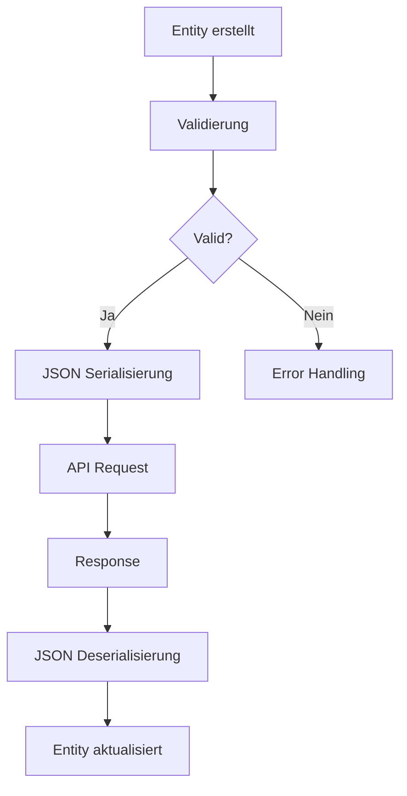

# Entity Übersicht

Diese Übersicht zeigt alle verfügbaren Entities in der Trainalyze-App.

## 📋 Verfügbare Entities

| Entity | Status | Beschreibung | Dokumentation |
|--------|--------|--------------|---------------|
| [User](./user.md) | ✅ Vollständig | Benutzer-Authentifizierung und Profile | [user.md](./user.md) |
| [Exercise](./exercise.md) | 🚧 Minimal | Trainingsübungen und Kategorien | [exercise.md](./exercise.md) |

## 🔄 Entity-Beziehungen

```
User (1) ──────── (*) UserProfile
  │
  └─── (*) WorkoutSession
         │
         └─── (*) ExerciseSet
                │
                └─── (1) Exercise
```

## 📝 Geplante Entities

### `UserProfile`
Erweiterte Benutzerprofile mit Körperdaten
```dart
class UserProfile {
  int? id;
  int userId;
  double? weight;        // Aktuelles Gewicht (kg)
  double? height;        // Größe (cm)  
  int? age;              // Alter
  String? gender;        // Geschlecht
  String? fitnessLevel;  // Fitness-Level
  DateTime? createdAt;
  DateTime? updatedAt;
}
```

### `WorkoutPlan`
Trainingspläne mit Übungsstrukturen
```dart
class WorkoutPlan {
  int? id;
  String name;
  String? description;
  int userId;
  List<WorkoutDay> days;
  DateTime? createdAt;
}
```

### `WorkoutSession` 
Einzelne Trainingseinheiten
```dart
class WorkoutSession {
  int? id;
  int userId;
  int? workoutPlanId;
  DateTime startTime;
  DateTime? endTime;
  List<ExerciseSet> sets;
  String? notes;
}
```

### `ExerciseSet`
Einzelne Übungssätze mit Wiederholungen/Gewicht
```dart
class ExerciseSet {
  int? id;
  int workoutSessionId;
  int exerciseId;
  int reps;
  double? weight;
  double? duration; // Für Cardio
  int setNumber;
  DateTime timestamp;
}
```

### `WeightEntry`
Körpergewicht-Verlauf
```dart
class WeightEntry {
  int? id;
  int userId;
  double weight;
  DateTime date;
  String? notes;
}
```

## 🎯 Naming Conventions

### Dart-Klassen
- **PascalCase**: `UserProfile`, `WorkoutPlan`
- **Eigenschaften**: camelCase (`userId`, `workoutPlanId`)
- **Konstanten**: UPPER_SNAKE_CASE
- **Private**: Prefix mit `_`

### JSON/API
- **Felder**: snake_case (`user_id`, `created_at`)
- **Enums**: lowercase (`kraft`, `cardio`)
- **Booleans**: true/false
- **Datumsformat**: ISO 8601 UTC

### Datenbank
- **Tabellen**: snake_case Plural (`users`, `workout_plans`)
- **Spalten**: snake_case (`user_id`, `created_at`)
- **Indizes**: `idx_tablename_columnname`
- **Foreign Keys**: `fk_tablename_columnname`

## 🔧 Entity-Methoden Standard

Jedes Entity sollte folgende Methoden implementieren:

```dart
class EntityTemplate {
  // Standard-Konstruktor
  EntityTemplate({required this.field1, this.field2});
  
  // JSON-Serialisierung
  factory EntityTemplate.fromJson(Map<String, dynamic> json);
  Map<String, dynamic> toJson();
  
  // Kopie mit Änderungen
  EntityTemplate copyWith({Type? field1, Type? field2});
  
  // String-Repräsentation
  @override
  String toString();
  
  // Gleichheitsvergleich
  @override
  bool operator ==(Object other);
  
  // Hash-Funktion
  @override
  int get hashCode;
  
  // Validierung
  bool isValid();
  List<String> validate();
}
```

## 📊 Entity Lifecycle



## 🚀 Implementierungsreihenfolge

1. **UserProfile** - Körperdaten und erweiterte Profile
2. **WeightEntry** - Gewichtsverlauf-Tracking
3. **WorkoutPlan** - Trainingsplan-Strukturen
4. **Exercise** - Erweiterte Übungs-Metadaten
5. **WorkoutSession** - Trainingseinheiten-Tracking
6. **ExerciseSet** - Detaillierte Satz-Daten

## 📋 Checkliste für neue Entities

- [ ] Dart-Klasse mit allen Feldern
- [ ] JSON fromJson/toJson Methoden
- [ ] copyWith Methode
- [ ] toString Override
- [ ] Equality Operator & hashCode
- [ ] Validierungslogik
- [ ] Unit Tests
- [ ] Markdown Dokumentation
- [ ] API Integration
- [ ] UI Integration